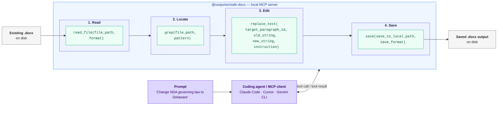

# Word-Dokumente (.docx) mit Programmier-Agenten via MCP bearbeiten — mit OpenDocument- (.odt-) Unterstützung

<!-- SYNC:badges BEGIN -->
[](https://github.com/usejunior/safe-docx/actions/workflows/ci.yml)
[](https://app.codecov.io/gh/usejunior/safe-docx)
[](https://www.npmjs.com/package/@usejunior/safe-docx)
[](https://github.com/UseJunior/safe-docx/blob/main/LICENSE)
[](https://github.com/UseJunior/safe-docx/commits/main)
[](https://github.com/UseJunior/safe-docx/issues?q=is%3Aissue+is%3Aclosed)
<!-- SYNC:badges END -->

<!-- SYNC:lang-nav BEGIN -->
[English](./README.md) | [Español](./README.es.md) | [简体中文](./README.zh.md) | [Português (Brasil)](./README.pt-br.md) | [Deutsch](./README.de.md)
<!-- SYNC:lang-nav END -->

> **Übersetzungshinweis:** Die englische Version `README.md` ist die kanonische Quelle der Wahrheit. Diese Übersetzung kann einen kurzen Rückstand haben. Wesentliche Aktualisierungen des englischen READMEs sollten innerhalb von 72 Stunden in diese Datei übernommen werden.

<!-- SYNC:architecture-diagram BEGIN -->

<!-- SYNC:architecture-diagram END -->

Safe Docx ist ein Open-Source-TypeScript-Stack für die chirurgische Bearbeitung bestehender Microsoft Word `.docx`-Dateien — und, über dieselbe Tool-Oberfläche, OpenDocument- `.odt`-Dateien. Es wurde für Workflows entwickelt, in denen ein Agent Änderungen vorschlägt und ein Mensch weiterhin zuverlässige, formatierungserhaltende Dokumentenbearbeitungen benötigt.

Wenn du Verträge mit KI prüfst, ist der langsamste Schritt oft das Anwenden akzeptierter Empfehlungen in Word. Safe Docx verwandelt das in deterministische Tool-Aufrufe.

## Warum dieses Projekt existiert

KI-Programmier-CLIs sind großartig bei Code und Textdateien, aber schwach bei der Bearbeitung bestehender `.docx`-Dateien. Geschäfts- und Rechts-Workflows laufen immer noch über Word-Dokumente, daher haben wir einen nativen TypeScript-Pfad gebaut für:

- Lesen und Durchsuchen bestehender Dokumente in token-effizienten Formaten
- Chirurgische Bearbeitungen ohne Zerstörung der Formatierung
- Saubere/nachverfolgte Ausgaben und Revisionsextraktions-Artefakte

Mission: Programmier-Agenten auch für Papierkram befähigen. Safe Docx konzentriert sich auf deterministische Bearbeitungen bestehender Word-Dateien, bei denen Formatierung und Review-Semantik die Automatisierung überleben müssen.

## Positionierung

Safe Docx ist optimiert für Agenten-Workflows, die deterministische, lokale Bearbeitungen bestehender `.docx`-Dateien benötigen:

- Typisierte MCP-Tools für Bearbeitung, Vergleich, Revisionsextraktion, Kommentare, Fußnoten und Layout
- Auditierbares Verhalten mit Testbelegen und Nachverfolgbarkeits-Artefakten
- TypeScript-Laufzeitverteilung ohne Python oder LibreOffice für unterstützte Nutzung

Safe Docx ist nicht dazu gedacht, generierungsorientierte `.docx`-Bibliotheken zu ersetzen.

## Standardkonformität

safe-docx zielt auf eine definierte Teilmenge von **ECMA-376 5. Auflage**.
Die vollständige Oberfläche (anvisierte Abschnitte, ausdrückliche
Nicht-Ziele und Verifizierungsstatus) liegt unter
[spec-compliance/CONFORMANCE.md](spec-compliance/CONFORMANCE.md). Diese
Datei wird automatisch aus dem Registry generiert und nur auf Englisch
als kanonische Quelle gepflegt.

## Vertraut von

- **Am Law Top-10-Kanzlei** — mehrstufige Vertragsübersetzungs-Pipeline
- **Regionalkanzlei mit 150 Anwälten** — 22M+ Tokens an Vertragskorrekturen verarbeitet
- **Gemini CLI** — kompatible Word-Bearbeitungs-MCP-Erweiterung

## Hier starten

```bash
npx -y @usejunior/safe-docx
```

Für detaillierte Einrichtung und Tool-Referenz siehe `packages/docx-mcp/README.md`.

### Beispiel: Agent bearbeitet einen Vertrag

Wenn du einem Programmier-Agenten (Claude Code, Cursor, Gemini CLI) mit installiertem Safe Docx einen Prompt gibst, führt der Agent MCP-Tool-Aufrufe wie diese aus:

```text
Benutzer: Bearbeite die NDA unter ~/docs/NDA.docx — ändere das
          anwendbare Recht von "State of New York" zu
          "State of Delaware" und speichere sowohl eine saubere
          Kopie als auch eine Kopie mit Änderungsnachverfolgung.

Agent-Aufrufe:

  1. read_file(file_path="~/docs/NDA.docx", format="toon")
     → Gibt Absätze mit stabilen IDs zurück: _bk_1, _bk_2, ...

  2. grep(file_path="~/docs/NDA.docx", pattern="State of New York")
     → Treffer in Absatz _bk_47

  3. replace_text(
       file_path="~/docs/NDA.docx",
       target_paragraph_id="_bk_47",
       old_string="State of New York",
       new_string="State of Delaware",
       instruction="Change governing law to Delaware"
     )

  4. save(
       file_path="~/docs/NDA.docx",
       save_to_local_path="~/docs/NDA-clean.docx",
       tracked_save_to_local_path="~/docs/NDA-tracked.docx",
       save_format="both"
     )
```

Der Agent verarbeitet die Tool-Aufrufe automatisch. Du erhältst eine saubere Datei und eine Datei mit Änderungsnachverfolgung zur menschlichen Überprüfung.

## MCP-Schnellstart

### Claude Code

```bash
claude mcp add safe-docx -- npx -y @usejunior/safe-docx
```

### Claude Desktop

Füge zu `~/Library/Application Support/Claude/claude_desktop_config.json` (macOS) oder `%APPDATA%\Claude\claude_desktop_config.json` (Windows) hinzu:

```json
{
  "mcpServers": {
    "safe-docx": {
      "command": "npx",
      "args": ["-y", "@usejunior/safe-docx"]
    }
  }
}
```

### Gemini CLI

```json
{
  "mcpServers": {
    "safe-docx": {
      "command": "npx",
      "args": ["-y", "@usejunior/safe-docx"]
    }
  }
}
```

### Beliebiger MCP-Client

- **Befehl:** `npx`
- **Args:** `["-y", "@usejunior/safe-docx"]`
- **Transport:** stdio

## Wofür Safe Docx optimiert ist

- Brownfield-Bearbeitung bestehender `.docx`-Dateien
- Formatierungserhaltende Textersetzung und Absatzeinfügung
- Kommentar- und Fußnoten-Workflows
- Nachverfolgte Ausgaben zur Überprüfung (`download`, `compare_documents`)
- Revisionsextraktion als strukturiertes JSON (`extract_revisions`)

## Erstellung von Grund auf

`@usejunior/docx-core` erzeugt auch neue `.docx`-Dateien aus einer deklarativen, JSON-serialisierbaren `DocumentSpec`: Abschnitte mit Kopf-/Fußzeilen und PAGE-/NUMPAGES-Feldern, benannte Stile, Tabellen, mehrstufige Nummerierung, juristische Dokumentrezepte (`coverTermsTable`, `signatureBlock`) und eine trennbare Entwurfsnotiz-Ebene, die zu OOXML-Kommentaren kompiliert wird. Die Erzeugung ist deterministisch (identische Specs erzeugen byte-identische Pakete) und unterliegt derselben ECMA-376-Konformitätsdisziplin wie der Bearbeitungspfad:

```ts
import { generateDocx } from '@usejunior/docx-core';

const buffer = await generateDocx({
  sections: [{ blocks: [{ kind: 'paragraph', runs: [{ kind: 'text', text: 'Hello' }] }] }],
});
```

Die Erzeugung ist derzeit eine Library-API; der MCP-Server stellt noch kein `generate_document`-Tool bereit.

## Wofür Safe Docx nicht optimiert ist

Die lokale Safe-Docx-Laufzeit weist Word-Vorlagendateien (`.dotx`) derzeit bewusst zurück. Wandle die Vorlage in ein normales `.docx`-Dokument um, bevor du sie hier öffnest. Safe Docx macht außerdem keine Rendering-, Layout- oder Paginierungsgarantien — erzeugte und bearbeitete Dokumente werden strukturell und gegen ECMA-376 validiert, nicht pixelgenau.

## Dokumentenfamilien

### Automatisierte Fixture-Abdeckung in diesem Repository

- Common-Paper-Stil gegenseitige NDA-Fixtures
- Bonterms gegenseitiges NDA-Fixture
- Letter-of-Intent-Fixture
- ILPA Limited-Partnership-Agreement-Redline-Fixtures

### Für komplexe juristische und geschäftliche `.docx`-Klassen konzipiert

- NVCA-Finanzierungsformulare
- YC SAFEs
- Angebotsmemoranden
- Bestellformulare und Dienstleistungsvereinbarungen
- Limited-Partnership-Agreements

## Pakete

- `@usejunior/docx-core`: Primitive und Vergleichs-Engine für bestehende `.docx`-Dokumente
- `@usejunior/odf-core`: OpenDocument- (`.odt`) Primitive und Vergleichs-Engine mit Änderungsnachverfolgung
- `@usejunior/docx-mcp`: MCP-Server-Implementierung und Tool-Oberfläche
- `@usejunior/safe-docx`: Kanonischer Installationsname für Endbenutzer (`npx -y @usejunior/safe-docx`)
- `@usejunior/safedocx-mcpb`: Privater MCP-Bundle-Wrapper

## Zuverlässigkeit und Vertrauensoberfläche

- Tool-Schemas werden aus `packages/docx-mcp/src/tool_catalog.ts` generiert.
- OpenSpec-Nachverfolgbarkeitsmatrix: `packages/docx-mcp/src/testing/SAFE_DOCX_OPENSPEC_TRACEABILITY.md`
- Annahmenmatrix: `packages/docx-mcp/assumptions.md`
- Konformitätsleitfaden: `docs/safe-docx/sprint-3-conformance.md`

## Häufig gestellte Fragen

### Was ist Safe Docx?

Ein TypeScript-first DOCX-Bearbeitungs-Stack für Programmier-Agenten-Workflows, die deterministische, formatierungserhaltende Bearbeitungen bestehender Word-Dokumente benötigen.

### Wird die Formatierung bei Bearbeitungen beibehalten?

Das ist ein zentrales Designziel. Die Tool-Oberfläche basiert auf chirurgischen Operationen (`replace_text`, `insert_paragraph`, Layout-Steuerung), die Dokumentstruktur und Formatierungssemantik so weit wie möglich erhalten.

### Wird .NET, Python oder LibreOffice im normalen Laufzeitbetrieb benötigt?

Nein. Die unterstützte Laufzeitnutzung ist JavaScript/TypeScript mit `jszip` + `@xmldom/xmldom`.

### Kann man damit Verträge von Grund auf erstellen?

Ja. `@usejunior/docx-core` liefert `generateDocx(spec)` — einen deklarativen DocumentSpec-Compiler für Abschnitte, Kopf-/Fußzeilen, Felder, Stile, Tabellen, mehrstufige Nummerierung, juristische Rezepte (Cover-Terms-Tabellen, Signaturblöcke) und eine trennbare Entwurfsnotiz-Ebene. Brownfield-Bearbeitung bestehender Dokumente bleibt der Hauptfokus; die Erzeugung nutzt dieselbe Konformitäts- und Validierungsinfrastruktur.

### Welche Dokumenttypen wurden in den Repository-Fixtures getestet?

Gegenseitige NDAs (einschließlich Common-Paper/Bonterms-Stil-Fixtures), Letter of Intent und ILPA Limited-Partnership-Agreement-Redline-Fixtures.

### Ist das nur für Anwälte?

Nein. Die gleichen Bearbeitungsprobleme bei bestehenden `.docx`-Dateien treten in HR, Beschaffung, Finanzen, Vertrieb und anderen papierkramintensiven Workflows auf.

### Wo sollte ich als MCP-Benutzer anfangen?

Verwende `@usejunior/safe-docx` über `npx`, dann folge den Einrichtungsbeispielen in `packages/docx-mcp/README.md`.

### Wo kann ich die Tool-Schemas einsehen?

Siehe die generierte Referenz unter `packages/docx-mcp/docs/tool-reference.generated.md`.

## Entwicklung

```bash
npm ci
npm run build
npm run lint --workspaces --if-present
npm run test:run
npm run check:spec-coverage
npm run test:coverage:packages
npm run coverage:packages:check
npm run coverage:matrix
```

## Siehe auch

- [Open Agreements](https://github.com/open-agreements/open-agreements) — Standardmäßige Rechtsvorlagen mit Programmier-Agenten ausfüllen (NDAs, SAFEs, NVCA)

## Datenschutz

Safe Docx läuft vollständig auf deinem lokalen Rechner. Es werden keine Dokumenteninhalte an externe Server gesendet. Siehe unsere [Datenschutzrichtlinie](https://usejunior.com/privacy_policy?utm_source=github&utm_medium=readme&utm_campaign=safe-docx) für Details.

## Governance

- [Beitragsleitfaden](CONTRIBUTING.md)
- [Verhaltenskodex](CODE_OF_CONDUCT.md)
- [Sicherheitsrichtlinie](SECURITY.md)
- [Änderungsprotokoll](CHANGELOG.md)
