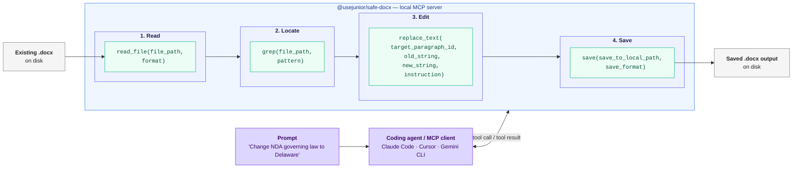

# Edita documentos de Word (.docx) con agentes de programación vía MCP — con soporte para OpenDocument (.odt)

<!-- SYNC:badges BEGIN -->
[](https://github.com/usejunior/safe-docx/actions/workflows/ci.yml)
[](https://app.codecov.io/gh/usejunior/safe-docx)
[](https://www.npmjs.com/package/@usejunior/safe-docx)
[](https://github.com/UseJunior/safe-docx/blob/main/LICENSE)
[](https://github.com/UseJunior/safe-docx/commits/main)
[](https://github.com/UseJunior/safe-docx/issues?q=is%3Aissue+is%3Aclosed)
<!-- SYNC:badges END -->

<!-- SYNC:issue-quick-links BEGIN -->
[Report Bug](https://github.com/usejunior/safe-docx/issues/new?template=bug_report.yml) · [Request Feature](https://github.com/usejunior/safe-docx/issues/new?template=feature_request.yml)
<!-- SYNC:issue-quick-links END -->

<!-- SYNC:lang-nav BEGIN -->
[English](./README.md) | [Español](./README.es.md) | [简体中文](./README.zh.md) | [Português (Brasil)](./README.pt-br.md) | [Deutsch](./README.de.md)
<!-- SYNC:lang-nav END -->

> **Nota de traducción:** La versión en inglés `README.md` es la fuente canónica de la verdad. Esta traducción puede tener un breve retraso. Las actualizaciones importantes del README en inglés deben sincronizarse con este archivo en un plazo de 72 horas.

<!-- SYNC:architecture-diagram BEGIN -->

<!-- SYNC:architecture-diagram END -->

Safe Docx es un stack de TypeScript de código abierto para la edición quirúrgica de archivos Microsoft Word `.docx` existentes y, mediante la misma superficie de herramientas, archivos OpenDocument `.odt`. Está diseñado para flujos de trabajo donde un agente propone cambios y un humano aún necesita ediciones de documentos confiables que preserven el formato.

Si revisas contratos con IA, el paso más lento suele ser aplicar las recomendaciones aceptadas en Word. Safe Docx convierte eso en llamadas de herramientas deterministas.

## Por qué existe este proyecto

Los CLIs de programación con IA son excelentes con código y archivos de texto, pero débiles en la edición de archivos `.docx` existentes. Los flujos de trabajo empresariales y legales aún funcionan con documentos de Word, así que construimos una ruta nativa en TypeScript para:

- leer y buscar documentos existentes en formatos eficientes en tokens
- realizar ediciones quirúrgicas sin destruir el formato
- producir salidas limpias/con control de cambios y artefactos de extracción de revisiones

Misión: permitir que los agentes de programación también hagan papeleo. Safe Docx se enfoca en ediciones deterministas de archivos Word existentes donde el formato y la semántica de revisión deben sobrevivir a la automatización.

## Posicionamiento

Safe Docx está optimizado para flujos de trabajo de agentes que necesitan ediciones deterministas y locales de archivos `.docx` existentes:

- herramientas MCP tipadas para edición, comparación, extracción de revisiones, comentarios, notas al pie y diseño
- comportamiento auditable con evidencia de pruebas y artefactos de trazabilidad
- distribución en tiempo de ejecución TypeScript sin requerir Python o LibreOffice para el uso soportado

Safe Docx no pretende reemplazar bibliotecas de `.docx` orientadas a la generación.

## Conformidad con estándares

safe-docx apunta a un subconjunto definido de **ECMA-376 5ª edición**. La
superficie completa (secciones objetivo, no objetivos y estado de
verificación) se encuentra en
[spec-compliance/CONFORMANCE.md](spec-compliance/CONFORMANCE.md), que se
genera automáticamente desde el registro y se mantiene como fuente
canónica únicamente en inglés.

## Confían en nosotros

- **Firma Am Law top-10** — pipeline de traducción de contratos multietapa
- **Firma regional de 150 abogados** — 22M+ tokens de marcado de contratos procesados
- **Gemini CLI** — extensión MCP compatible para edición de Word

## Comienza aquí

```bash
npx -y @usejunior/safe-docx
```

Para configuración detallada y referencia de herramientas, consulta `packages/docx-mcp/README.md`.

### Ejemplo: Agente editando un contrato

Cuando le das un prompt a un agente de programación (Claude Code, Cursor, Gemini CLI) con Safe Docx instalado, el agente realiza llamadas de herramientas MCP como estas:

```text
Usuario: Edita el NDA en ~/docs/NDA.docx — cambia la ley aplicable
         de "State of New York" a "State of Delaware" y guarda tanto
         una copia limpia como una copia con control de cambios.

Llamadas del agente:

  1. read_file(file_path="~/docs/NDA.docx", format="toon")
     → Retorna párrafos con IDs estables: _bk_1, _bk_2, ...

  2. grep(file_path="~/docs/NDA.docx", pattern="State of New York")
     → Coincidencia en párrafo _bk_47

  3. replace_text(
       file_path="~/docs/NDA.docx",
       target_paragraph_id="_bk_47",
       old_string="State of New York",
       new_string="State of Delaware",
       instruction="Change governing law to Delaware"
     )

  4. save(
       file_path="~/docs/NDA.docx",
       save_to_local_path="~/docs/NDA-clean.docx",
       tracked_save_to_local_path="~/docs/NDA-tracked.docx",
       save_format="both"
     )
```

El agente maneja las llamadas de herramientas automáticamente. Obtienes un archivo limpio y un archivo con control de cambios para revisión humana.

## Inicio rápido MCP

### Claude Code

```bash
claude mcp add safe-docx -- npx -y @usejunior/safe-docx
```

### Claude Desktop

Añade a `~/Library/Application Support/Claude/claude_desktop_config.json` (macOS) o `%APPDATA%\Claude\claude_desktop_config.json` (Windows):

```json
{
  "mcpServers": {
    "safe-docx": {
      "command": "npx",
      "args": ["-y", "@usejunior/safe-docx"]
    }
  }
}
```

### Gemini CLI

```json
{
  "mcpServers": {
    "safe-docx": {
      "command": "npx",
      "args": ["-y", "@usejunior/safe-docx"]
    }
  }
}
```

### Cualquier cliente MCP

- **Comando:** `npx`
- **Args:** `["-y", "@usejunior/safe-docx"]`
- **Transporte:** stdio

## Para qué está optimizado Safe Docx

- Edición brownfield de archivos `.docx` existentes
- Reemplazo de texto e inserción de párrafos que preservan el formato
- Flujos de trabajo de comentarios y notas al pie
- Salidas con control de cambios para revisión (`download`, `compare_documents`)
- Extracción de revisiones como JSON estructurado (`extract_revisions`)

## Generación desde cero

`@usejunior/docx-core` también genera nuevos archivos `.docx` desde una `DocumentSpec` declarativa y serializable como JSON: secciones con encabezados/pies de página y campos PAGE/NUMPAGES, estilos con nombre, tablas, numeración multinivel y una capa separable de notas de redacción compilada como comentarios OOXML. La generación es determinista (especificaciones idénticas producen paquetes byte-idénticos) y sigue la misma disciplina de conformidad ECMA-376 que la ruta de edición:

```ts
import { generateDocx } from '@usejunior/docx-core';

const buffer = await generateDocx({
  sections: [{ blocks: [{ kind: 'paragraph', runs: [{ kind: 'text', text: 'Hello' }] }] }],
});
```

La generación es actualmente una API de biblioteca; el servidor MCP aún no expone una herramienta `generate_document`.

## Para qué no está optimizado Safe Docx

El runtime local de Safe Docx rechaza intencionalmente por ahora los archivos de plantilla de Word (`.dotx`). Convierte la plantilla en un documento `.docx` normal antes de abrirla aquí. Safe Docx tampoco ofrece garantías de renderizado, diseño o paginación: los documentos generados y editados se validan estructuralmente y contra ECMA-376, no píxel por píxel.

## Familias de documentos

### Cobertura automatizada de fixtures en este repositorio

- Fixtures de NDA mutuo estilo Common Paper
- Fixture de NDA mutuo Bonterms
- Fixture de Carta de Intención
- Fixtures de redline de acuerdo de sociedad limitada ILPA

### Diseñado para clases complejas de `.docx` legales y empresariales

- Formularios de financiamiento NVCA
- SAFEs de YC
- Memorandos de oferta
- Formularios de pedido y acuerdos de servicios
- Acuerdos de sociedad limitada

## Paquetes

- `@usejunior/docx-core`: primitivas y motor de comparación para documentos `.docx` existentes
- `@usejunior/odf-core`: primitivas OpenDocument (`.odt`) y motor de comparación con control de cambios
- `@usejunior/docx-mcp`: implementación del servidor MCP y superficie de herramientas
- `@usejunior/safe-docx`: nombre canónico de instalación para el usuario final (`npx -y @usejunior/safe-docx`)
- `@usejunior/safedocx-mcpb`: wrapper privado de bundle MCP

## Confiabilidad y superficie de confianza

- Los esquemas de herramientas se generan desde `packages/docx-mcp/src/tool_catalog.ts`.
- Matriz de trazabilidad OpenSpec: `packages/docx-mcp/src/testing/SAFE_DOCX_OPENSPEC_TRACEABILITY.md`
- Matriz de supuestos: `packages/docx-mcp/assumptions.md`
- Guía de conformidad: `docs/safe-docx/sprint-3-conformance.md`

## Preguntas frecuentes

### ¿Qué es Safe Docx?

Un stack de edición DOCX con TypeScript como prioridad para flujos de trabajo de agentes de programación que necesitan ediciones deterministas y que preservan el formato en documentos Word existentes.

### ¿Preserva el formato durante las ediciones?

Ese es un objetivo central de diseño. La superficie de herramientas está construida alrededor de operaciones quirúrgicas (`replace_text`, `insert_paragraph`, controles de diseño) que preservan la estructura del documento y la semántica de formato tanto como sea posible.

### ¿Requiere .NET, Python o LibreOffice en uso normal?

No. El uso soportado en tiempo de ejecución es JavaScript/TypeScript con `jszip` + `@xmldom/xmldom`.

### ¿Puede generar contratos desde cero?

Sí. `@usejunior/docx-core` incluye `generateDocx(spec)`: un compilador declarativo de DocumentSpec que cubre secciones, encabezados/pies de página, campos, estilos, tablas, numeración multinivel y una capa separable de notas de redacción. La edición brownfield de documentos existentes sigue siendo el enfoque principal; la generación comparte la maquinaria de conformidad y validación.

### ¿Qué tipos de documentos se han probado en los fixtures del repositorio?

NDAs mutuos (incluyendo fixtures estilo Common Paper/Bonterms), Carta de Intención y fixtures de redline de acuerdo de sociedad limitada ILPA.

### ¿Esto es solo para abogados?

No. Los mismos problemas de edición de archivos `.docx` existentes aparecen en recursos humanos, adquisiciones, finanzas, operaciones de ventas y otros flujos de trabajo con mucho papeleo.

### ¿Por dónde debería empezar como usuario de MCP?

Usa `@usejunior/safe-docx` vía `npx`, luego sigue los ejemplos de configuración en `packages/docx-mcp/README.md`.

### ¿Dónde puedo inspeccionar los esquemas de herramientas?

Consulta la referencia generada en `packages/docx-mcp/docs/tool-reference.generated.md`.

## Desarrollo

```bash
npm ci
npm run build
npm run lint --workspaces --if-present
npm run test:run
npm run check:spec-coverage
npm run test:coverage:packages
npm run coverage:packages:check
npm run coverage:matrix
```

## Ver también

- [Open Agreements](https://github.com/open-agreements/open-agreements) — llena plantillas legales estándar con agentes de programación (NDAs, SAFEs, NVCA)

## Privacidad

Safe Docx se ejecuta completamente en tu máquina local. No se envía contenido de documentos a servidores externos. Consulta nuestra [Política de Privacidad](https://usejunior.com/privacy_policy?utm_source=github&utm_medium=readme&utm_campaign=safe-docx) para más detalles.

## Gobernanza

- [Guía de contribución](CONTRIBUTING.md)
- [Código de conducta](CODE_OF_CONDUCT.md)
- [Política de seguridad](SECURITY.md)
- [Registro de cambios](CHANGELOG.md)
