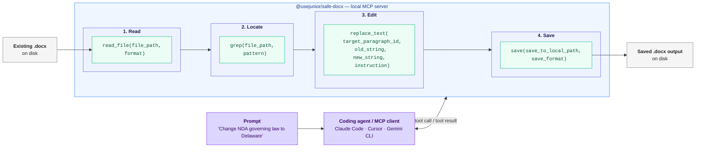

# Edit Word documents (.docx) with coding agents via MCP — with OpenDocument (.odt) support

<!-- SYNC:badges BEGIN -->
[](https://github.com/usejunior/safe-docx/actions/workflows/ci.yml)
[](https://app.codecov.io/gh/usejunior/safe-docx)
[](https://www.npmjs.com/package/@usejunior/safe-docx)
[](https://github.com/UseJunior/safe-docx/blob/main/LICENSE)
[](https://github.com/UseJunior/safe-docx/commits/main)
[](https://github.com/UseJunior/safe-docx/issues?q=is%3Aissue+is%3Aclosed)
<!-- SYNC:badges END -->

<!-- SYNC:lang-nav BEGIN -->
[English](./README.md) | [Español](./README.es.md) | [简体中文](./README.zh.md) | [Português (Brasil)](./README.pt-br.md) | [Deutsch](./README.de.md)
<!-- SYNC:lang-nav END -->

<!-- SYNC:architecture-diagram BEGIN -->

<!-- SYNC:architecture-diagram END -->

Safe Docx is an open-source TypeScript stack for surgical editing of existing Microsoft Word `.docx` files — and, through the same tool surface, OpenDocument `.odt` files. It is built for workflows where an agent proposes changes and a human still needs reliable, formatting-preserving document edits.

If you review contracts with AI, the slowest step is often applying accepted recommendations in Word. Safe Docx turns that into deterministic tool calls.

## Why This Exists

AI coding CLIs are great with code and text files but weak on brownfield `.docx` editing. Business and legal workflows still run on Word documents, so we built a native TypeScript path for:

- reading and searching existing documents in token-efficient formats
- making surgical edits without destroying formatting
- producing clean/tracked outputs and revision extraction artifacts

Mission: enable coding agents to do paperwork too. Safe Docx focuses on deterministic edits to existing Word files where formatting and review semantics must survive automation.

## How Safe Docx is Different from other Docx Editors

Safe Docx is optimized for agent workflows that need deterministic, local-first edits on existing `.docx` files:

- typed MCP tools for edit, compare, revision extraction, comments, footnotes, and layout
- auditable behavior with test evidence and traceability artifacts
- TypeScript runtime distribution without requiring Python or LibreOffice for supported usage

Safe Docx is not intended to replace generation-first `.docx` libraries.

## Standards Conformance

<!-- AUTO-GENERATED:conformance-summary START — generated by scripts/generate_conformance_doc.mjs; do not edit by hand -->
safe-docx targets a defined subset of **ECMA-376 5th edition**. The full surface
(targeted sections, Non-Goals, and verification status) lives at
[spec-compliance/CONFORMANCE.md](spec-compliance/CONFORMANCE.md).

- **65** sections claimed
- **5** sections explicitly out-of-scope (Non-Goals)
- **0** known gaps under `@conformance-gap`
- Vendored normative schemas: `spec-compliance/ecma-376/schemas/`
<!-- AUTO-GENERATED:conformance-summary END -->

## Trusted By

- **Am Law top-10 firm** — multistep contract translation pipeline
- **150-lawyer regional firm** — 22M+ tokens of contract markup processed
- **Gemini CLI** — compatible Word editing MCP extension

## Start Here

```bash
npx -y @usejunior/safe-docx
```

For detailed setup and tool reference, see `packages/docx-mcp/README.md`.

### Example: Agent Editing a Contract

When you prompt a coding agent (Claude Code, Cursor, Gemini CLI) with Safe Docx installed, the agent makes MCP tool calls like these:

```text
User: Edit the NDA at ~/docs/NDA.docx — change the governing law
      from "State of New York" to "State of Delaware" and save both
      a clean copy and a tracked-changes copy.

Agent calls:

  1. read_file(file_path="~/docs/NDA.docx", format="toon")
     → Returns paragraphs with stable IDs:
       _bk_a3f29c10b8e4, _bk_7d2e8f1a4c5b, ...
       (12-char hex hashes derived from intrinsic w14:paraId
        or normalized text — byte-identical across reopens
        for identical stored DOCX bytes)

  2. grep(file_path="~/docs/NDA.docx", pattern="State of New York")
     → Match in paragraph _bk_e4c8a91f2d36

  3. replace_text(
       file_path="~/docs/NDA.docx",
       target_paragraph_id="_bk_e4c8a91f2d36",
       old_string="State of New York",
       new_string="State of Delaware",
       instruction="Change governing law to Delaware"
     )

  4. save(
       file_path="~/docs/NDA.docx",
       save_to_local_path="~/docs/NDA-clean.docx",
       tracked_save_to_local_path="~/docs/NDA-tracked.docx",
       save_format="both"
     )
```

The agent handles the tool calls automatically. You get a clean file and a tracked-changes file for human review.

## MCP Quickstart

### Claude Code

```bash
claude mcp add safe-docx -- npx -y @usejunior/safe-docx
```

### Claude Desktop

Add to `~/Library/Application Support/Claude/claude_desktop_config.json` (macOS) or `%APPDATA%\Claude\claude_desktop_config.json` (Windows):

```json
{
  "mcpServers": {
    "safe-docx": {
      "command": "npx",
      "args": ["-y", "@usejunior/safe-docx"]
    }
  }
}
```

### Gemini CLI

```json
{
  "mcpServers": {
    "safe-docx": {
      "command": "npx",
      "args": ["-y", "@usejunior/safe-docx"]
    }
  }
}
```

### Any MCP Client

- **Command:** `npx`
- **Args:** `["-y", "@usejunior/safe-docx"]`
- **Transport:** stdio

## What Safe Docx Is Optimized For

- Brownfield editing of existing `.docx` files
- Formatting-preserving text replacement and paragraph insertion
- Comment and footnote workflows
- Tracked-changes outputs for review (`download`, `compare_documents`)
- Revision extraction as structured JSON (`extract_revisions`)
- OpenDocument (`.odt`) sessions: read, search, edit, comment, save, and `compare_documents` redlines (see below)

## From-Scratch Generation

`@usejunior/docx-core` also generates new `.docx` files from a declarative, JSON-serializable `DocumentSpec` — sections with headers/footers and PAGE/NUMPAGES fields, named styles, tables, multi-level numbering, plus legal-document recipes (`coverTermsTable`, `signatureBlock`) and a separable drafting-note layer compiled to OOXML comments. Generation is deterministic (identical specs produce byte-identical packages) and held to the same ECMA-376 conformance discipline as the editing path:

```ts
import { generateDocx } from '@usejunior/docx-core';

const buffer = await generateDocx({
  sections: [{ blocks: [{ kind: 'paragraph', runs: [{ kind: 'text', text: 'Hello' }] }] }],
});
```

Generation is currently a library API; the MCP server does not yet expose a `generate_document` tool.

## What Safe Docx Is Not Optimized For

The local Safe Docx runtime intentionally rejects Word template files (`.dotx`) for now. Convert the template to a normal `.docx` document before opening it here. Safe Docx also makes no rendering, layout, or pagination guarantees — generated and edited documents are validated structurally and against ECMA-376, not pixel-by-pixel.

## OpenDocument (`.odt`) Support

Teams on LibreOffice have the same problem as teams on Word: edits without a record. The core session tools — `read_file`, `grep`, `replace_text`, `insert_paragraph`, `add_comment`, `get_comments`, `save` — work directly on `.odt` files, and `compare_documents` writes a native ODF tracked-changes redline: compare two files, or a live editing session against the original it was opened from.

ODF changes are tracked inline at run level: edits within a paragraph appear as word-level insertions and deletions rather than whole-paragraph replacements. The redline round-trips in LibreOffice: accepting all changes reproduces the edited document, rejecting all restores the original. See the [tool reference](packages/docx-mcp/docs/tool-reference.generated.md) for per-tool format support.

## Document Families

### Automated fixture coverage in this repo

- Common Paper style mutual NDA fixtures
- Bonterms mutual NDA fixture
- Letter of Intent fixture
- ILPA limited partnership agreement redline fixtures

### Designed for complex legal and business `.docx` classes

- NVCA financing forms
- YC SAFEs
- Offering memoranda
- Order forms and services agreements
- Limited partnership agreements

## Packages

- `@usejunior/docx-core`: primitives + comparison engine for existing `.docx` documents
- `@usejunior/odf-core`: OpenDocument (`.odt`) primitives + tracked-changes comparison engine
- `@usejunior/docx-mcp`: MCP server implementation and tool surface
- `@usejunior/safe-docx`: canonical end-user install name (`npx -y @usejunior/safe-docx`)
- `@usejunior/safedocx-mcpb`: private MCP bundle wrapper

## Reliability and Trust Surface

- Tool schemas are generated from `packages/docx-mcp/src/tool_catalog.ts`.
- For the contract surface of AI-attributable edits, see [SUPPORT.md](packages/docx-core/SUPPORT.md).
- OpenSpec traceability matrix: `packages/docx-mcp/src/testing/SAFE_DOCX_OPENSPEC_TRACEABILITY.md`
- Assumption matrix: `packages/docx-mcp/assumptions.md`
- Conformance guide: `docs/safe-docx/sprint-3-conformance.md`

## FAQ

### What is Safe Docx?

A TypeScript-first DOCX editing stack for coding-agent workflows that need deterministic, formatting-preserving edits on existing Word documents.

### Does this preserve formatting during edits?

That is a core design goal. The tool surface is built around surgical operations (`replace_text`, `insert_paragraph`, layout controls) that preserve document structure and formatting semantics as much as possible.

### Does this require .NET, Python, or LibreOffice in normal runtime usage?

No. Supported runtime usage is JavaScript/TypeScript with `jszip` + `@xmldom/xmldom`.

### Can this generate contracts from scratch?

Yes. `@usejunior/docx-core` ships `generateDocx(spec)` — a declarative DocumentSpec compiler covering sections, headers/footers, fields, styles, tables, multi-level numbering, legal recipes (cover-terms tables, signature blocks), and a separable drafting-note layer. Brownfield editing of existing documents remains the primary focus; generation shares its conformance and validation machinery.

### What document types has this been tested on in-repo fixtures?

Mutual NDAs (including Common Paper/Bonterms-style fixtures), Letter of Intent, and ILPA limited partnership agreement redline fixtures.

### Is this only for lawyers?

No. The same brownfield `.docx` editing problems appear in HR, procurement, finance, sales ops, and other paperwork-heavy workflows.

### Where should I start as an MCP user?

Use `@usejunior/safe-docx` via `npx`, then follow setup examples in `packages/docx-mcp/README.md`.

### Where can I inspect the tool schemas?

See the generated reference at `packages/docx-mcp/docs/tool-reference.generated.md`.

## Development

```bash
npm ci
npm run build
npm run lint --workspaces --if-present
npm run test:run
npm run check:spec-coverage
npm run test:coverage:packages
npm run coverage:packages:check
npm run coverage:matrix
```

## See Also

- [Open Agreements](https://github.com/open-agreements/open-agreements) — fill standard legal templates with coding agents (NDAs, SAFEs, NVCA)

## Privacy

Safe Docx runs entirely on your local machine. No document content is sent to external servers. See our [Privacy Policy](https://usejunior.com/privacy_policy?utm_source=github&utm_medium=readme&utm_campaign=safe-docx) for details.

## Governance

- [Contributing Guide](CONTRIBUTING.md)
- [Code of Conduct](CODE_OF_CONDUCT.md)
- [Security Policy](SECURITY.md)
- [Changelog](CHANGELOG.md)
