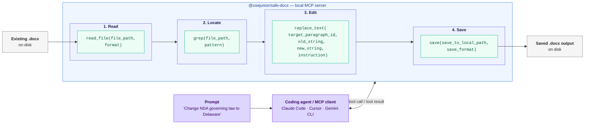

# Edite documentos do Word (.docx) com agentes de programação via MCP

<!-- SYNC:badges BEGIN -->
[](https://github.com/usejunior/safe-docx/actions/workflows/ci.yml)
[](https://app.codecov.io/gh/usejunior/safe-docx)
[](https://www.npmjs.com/package/@usejunior/safe-docx)
[](https://github.com/UseJunior/safe-docx/blob/main/LICENSE)
[](https://github.com/UseJunior/safe-docx/commits/main)
[](https://github.com/UseJunior/safe-docx/issues?q=is%3Aissue+is%3Aclosed)
<!-- SYNC:badges END -->

<!-- SYNC:lang-nav BEGIN -->
[English](./README.md) | [Español](./README.es.md) | [简体中文](./README.zh.md) | [Português (Brasil)](./README.pt-br.md) | [Deutsch](./README.de.md)
<!-- SYNC:lang-nav END -->

> **Nota de tradução:** A versão em inglês `README.md` é a fonte canônica da verdade. Esta tradução pode ter um breve atraso. Atualizações importantes do README em inglês devem ser sincronizadas com este arquivo em até 72 horas.

<!-- SYNC:architecture-diagram BEGIN -->

<!-- SYNC:architecture-diagram END -->

Safe Docx é um stack TypeScript de código aberto para edição cirúrgica de arquivos Microsoft Word `.docx` existentes. Foi construído para fluxos de trabalho onde um agente propõe alterações e um humano ainda precisa de edições de documentos confiáveis que preservem a formatação.

Se você revisa contratos com IA, a etapa mais lenta geralmente é aplicar as recomendações aceitas no Word. Safe Docx transforma isso em chamadas de ferramentas determinísticas.

## Por que este projeto existe

CLIs de programação com IA são ótimos com código e arquivos de texto, mas fracos na edição de arquivos `.docx` existentes. Fluxos de trabalho empresariais e jurídicos ainda funcionam com documentos Word, então construímos um caminho nativo em TypeScript para:

- ler e pesquisar documentos existentes em formatos eficientes em tokens
- fazer edições cirúrgicas sem destruir a formatação
- produzir saídas limpas/com controle de alterações e artefatos de extração de revisões

Missão: permitir que agentes de programação também façam burocracia. Safe Docx foca em edições determinísticas de arquivos Word existentes onde a formatação e a semântica de revisão devem sobreviver à automação.

## Posicionamento

Safe Docx é otimizado para fluxos de trabalho de agentes que precisam de edições determinísticas e locais em arquivos `.docx` existentes:

- ferramentas MCP tipadas para edição, comparação, extração de revisões, comentários, notas de rodapé e layout
- comportamento auditável com evidências de teste e artefatos de rastreabilidade
- distribuição em tempo de execução TypeScript sem necessidade de Python ou LibreOffice para uso suportado

Safe Docx não pretende substituir bibliotecas de `.docx` orientadas à geração.

## Conformidade com padrões

safe-docx mira um subconjunto definido da **ECMA-376 5ª edição**. A
superfície completa (seções alvo, não-metas explícitas e status de
verificação) está em
[spec-compliance/CONFORMANCE.md](spec-compliance/CONFORMANCE.md), gerado
automaticamente a partir do registro e mantido como fonte canônica apenas
em inglês.

## Confiam em nós

- **Escritório Am Law top-10** — pipeline de tradução de contratos em múltiplas etapas
- **Escritório regional de 150 advogados** — 22M+ tokens de marcação de contratos processados
- **Gemini CLI** — extensão MCP compatível para edição de Word

## Comece aqui

```bash
npx -y @usejunior/safe-docx
```

Para configuração detalhada e referência de ferramentas, consulte `packages/docx-mcp/README.md`.

### Exemplo: Agente editando um contrato

Quando você dá um prompt a um agente de programação (Claude Code, Cursor, Gemini CLI) com Safe Docx instalado, o agente faz chamadas de ferramentas MCP como estas:

```text
Usuário: Edite o NDA em ~/docs/NDA.docx — altere a lei aplicável
         de "State of New York" para "State of Delaware" e salve tanto
         uma cópia limpa quanto uma cópia com controle de alterações.

Chamadas do agente:

  1. read_file(file_path="~/docs/NDA.docx", format="toon")
     → Retorna parágrafos com IDs estáveis: _bk_1, _bk_2, ...

  2. grep(file_path="~/docs/NDA.docx", pattern="State of New York")
     → Correspondência no parágrafo _bk_47

  3. replace_text(
       file_path="~/docs/NDA.docx",
       target_paragraph_id="_bk_47",
       old_string="State of New York",
       new_string="State of Delaware",
       instruction="Change governing law to Delaware"
     )

  4. save(
       file_path="~/docs/NDA.docx",
       save_to_local_path="~/docs/NDA-clean.docx",
       tracked_save_to_local_path="~/docs/NDA-tracked.docx",
       save_format="both"
     )
```

O agente lida com as chamadas de ferramentas automaticamente. Você recebe um arquivo limpo e um arquivo com controle de alterações para revisão humana.

## Início rápido MCP

### Claude Code

```bash
claude mcp add safe-docx -- npx -y @usejunior/safe-docx
```

### Claude Desktop

Adicione a `~/Library/Application Support/Claude/claude_desktop_config.json` (macOS) ou `%APPDATA%\Claude\claude_desktop_config.json` (Windows):

```json
{
  "mcpServers": {
    "safe-docx": {
      "command": "npx",
      "args": ["-y", "@usejunior/safe-docx"]
    }
  }
}
```

### Gemini CLI

```json
{
  "mcpServers": {
    "safe-docx": {
      "command": "npx",
      "args": ["-y", "@usejunior/safe-docx"]
    }
  }
}
```

### Qualquer cliente MCP

- **Comando:** `npx`
- **Args:** `["-y", "@usejunior/safe-docx"]`
- **Transporte:** stdio

## Para que o Safe Docx é otimizado

- Edição brownfield de arquivos `.docx` existentes
- Substituição de texto e inserção de parágrafos que preservam a formatação
- Fluxos de trabalho de comentários e notas de rodapé
- Saídas com controle de alterações para revisão (`download`, `compare_documents`)
- Extração de revisões como JSON estruturado (`extract_revisions`)

## Para que o Safe Docx não é otimizado

Safe Docx não é um toolkit de geração de documentos do zero.

Se sua necessidade principal é gerar novos arquivos `.docx` a partir de templates ou layout programático, use pacotes como [`docx`](https://www.npmjs.com/package/docx).

## Famílias de documentos

### Cobertura automatizada de fixtures neste repositório

- Fixtures de NDA mútuo estilo Common Paper
- Fixture de NDA mútuo Bonterms
- Fixture de Carta de Intenção
- Fixtures de redline de acordo de sociedade limitada ILPA

### Projetado para classes complexas de `.docx` jurídicos e empresariais

- Formulários de financiamento NVCA
- SAFEs do YC
- Memorandos de oferta
- Formulários de pedido e acordos de serviços
- Acordos de sociedade limitada

## Pacotes

- `@usejunior/docx-core`: primitivas e motor de comparação para documentos `.docx` existentes
- `@usejunior/docx-mcp`: implementação do servidor MCP e superfície de ferramentas
- `@usejunior/safe-docx`: nome canônico de instalação para o usuário final (`npx -y @usejunior/safe-docx`)
- `@usejunior/safedocx-mcpb`: wrapper privado de bundle MCP

## Confiabilidade e superfície de confiança

- Os esquemas de ferramentas são gerados a partir de `packages/docx-mcp/src/tool_catalog.ts`.
- Matriz de rastreabilidade OpenSpec: `packages/docx-mcp/src/testing/SAFE_DOCX_OPENSPEC_TRACEABILITY.md`
- Matriz de premissas: `packages/docx-mcp/assumptions.md`
- Guia de conformidade: `docs/safe-docx/sprint-3-conformance.md`

## Perguntas frequentes

### O que é Safe Docx?

Um stack de edição DOCX com TypeScript como prioridade para fluxos de trabalho de agentes de programação que precisam de edições determinísticas e que preservam a formatação em documentos Word existentes.

### Preserva a formatação durante as edições?

Esse é um objetivo central de design. A superfície de ferramentas é construída em torno de operações cirúrgicas (`replace_text`, `insert_paragraph`, controles de layout) que preservam a estrutura do documento e a semântica de formatação o máximo possível.

### Requer .NET, Python ou LibreOffice em uso normal?

Não. O uso suportado em tempo de execução é JavaScript/TypeScript com `jszip` + `@xmldom/xmldom`.

### Pode gerar contratos do zero?

Não é o foco principal. Para geração do zero, use pacotes como [`docx`](https://www.npmjs.com/package/docx).

### Quais tipos de documentos foram testados nos fixtures do repositório?

NDAs mútuos (incluindo fixtures estilo Common Paper/Bonterms), Carta de Intenção e fixtures de redline de acordo de sociedade limitada ILPA.

### Isso é só para advogados?

Não. Os mesmos problemas de edição de arquivos `.docx` existentes aparecem em recursos humanos, compras, finanças, operações de vendas e outros fluxos de trabalho com muita burocracia.

### Por onde devo começar como usuário de MCP?

Use `@usejunior/safe-docx` via `npx`, depois siga os exemplos de configuração em `packages/docx-mcp/README.md`.

### Onde posso inspecionar os esquemas de ferramentas?

Consulte a referência gerada em `packages/docx-mcp/docs/tool-reference.generated.md`.

## Desenvolvimento

```bash
npm ci
npm run build
npm run lint --workspaces --if-present
npm run test:run
npm run check:spec-coverage
npm run test:coverage:packages
npm run coverage:packages:check
npm run coverage:matrix
```

## Veja também

- [Open Agreements](https://github.com/open-agreements/open-agreements) — preencha templates jurídicos padrão com agentes de programação (NDAs, SAFEs, NVCA)

## Privacidade

Safe Docx é executado inteiramente na sua máquina local. Nenhum conteúdo de documento é enviado para servidores externos. Consulte nossa [Política de Privacidade](https://usejunior.com/privacy_policy) para detalhes.

## Governança

- [Guia de contribuição](CONTRIBUTING.md)
- [Código de conduta](CODE_OF_CONDUCT.md)
- [Política de segurança](SECURITY.md)
- [Registro de alterações](CHANGELOG.md)
